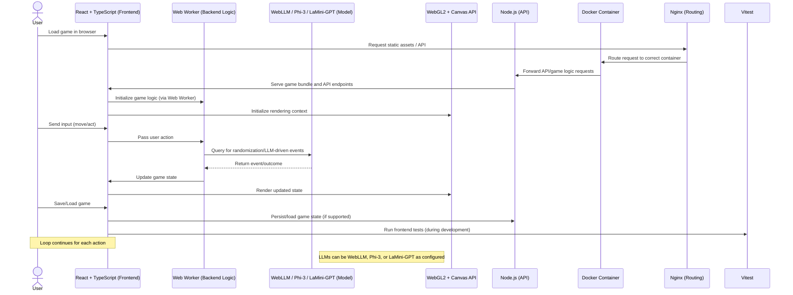
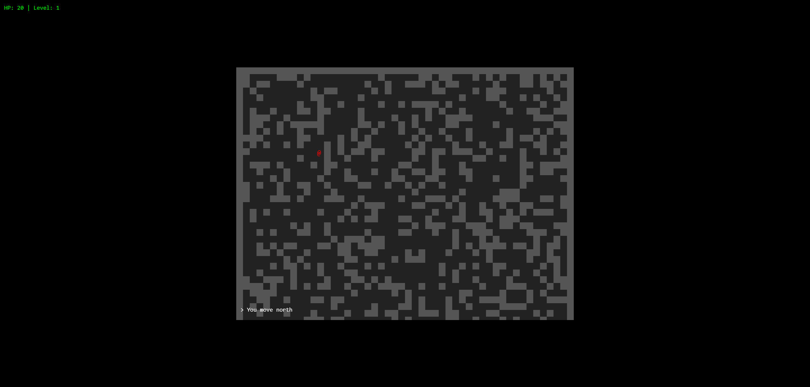

[](https://github.com/gongahkia/mago/releases/tag/1.0.0) 
[](https://github.com/gongahkia/mago/releases/tag/2.0.0) 

# `Mago` 🪧

Browser [Rougelike](https://en.wikipedia.org/wiki/Roguelike) with [LLM](#stack)-orchestrated randomisation.

## Stack

[`Mago` V1.0.0](#mago-v100)

* *Frontend*: [React](https://react.dev/), [TypeScript](https://www.typescriptlang.org/), [Vite](https://vite.dev/)
* *Backend*: [Node.js](https://nodejs.org/en), [Web Workers API](https://developer.mozilla.org/en-US/docs/Web/API/Web_Workers_API/Using_web_workers)
* *Graphics*: [WebGL2](https://get.webgl.org/webgl2/enable.html), [Canvas API](https://developer.mozilla.org/en-US/docs/Web/API/Canvas_API)
* *Package*: [Docker](https://www.docker.com/)
* *Routing*: [Nginx](https://nginx.org/)
* *Model*: [WebLLM](https://webllm.mlc.ai/), [microsoft/Phi-3-mini-4k-instruct](https://huggingface.co/microsoft/Phi-3-mini-4k-instruct), [Xenova/Phi-3-mini-4k-instruct](https://huggingface.co/Xenova/Phi-3-mini-4k-instruct), [Xenova/LaMini-GPT-774M](https://huggingface.co/Xenova/LaMini-GPT-774M)
* *Testing*: [Vitest](https://vitest.dev/)

[`Mago` V2.0.0](#mago-v200)

* *Frontend*: [HTML](https://developer.mozilla.org/en-US/docs/Web/HTML), [CSS](https://developer.mozilla.org/en-US/docs/Web/CSS), [JavaScript](https://developer.mozilla.org/en-US/docs/Web/JavaScript)
* *Backend*: [FastAPI](https://fastapi.tiangolo.com/), [Python](https://www.python.org/)
* *Graphics*: [Canvas API](https://developer.mozilla.org/en-US/docs/Web/API/Canvas_API)
* *Package*: [Docker](https://www.docker.com/)
* *Routing*: [Fetch API](https://developer.mozilla.org/en-US/docs/Web/API/Fetch_API), [WEb Workers API](https://developer.mozilla.org/en-US/docs/Web/API/Web_Workers_API)
* *Model*: [Ollama](https://ollama.com/), [Ollama/llama3:8b-instruct-q2_K](https://ollama.com/library/llama3:8b-instruct-q2_K)

## Usage

The below instructions are for locally hosting `Mago`.

1. Execute the following to build and start Mago in production or development *(with optional hot reloading)*.

```console
$ git clone https://github.com/gongahkia/mago
$ cd mago/mago-app-v1 && make build
$ cd mago/mago-app-v2 && docker-compose up --build
```

## Architecture

### `Mago` V1.0.0



### `Mago` V2.0.0

```mermaid

```

## Screenshots



## Reference

The name `Mago` is in reference to [Mago](https://yokwe-yokai-of-korea.fandom.com/de/wiki/Mago) (마고), the primordial goddess of creation within the [Korean Mythos](https://en.wikipedia.org/wiki/Korean_mythology) who later became the island of [Jeju](https://en.wikipedia.org/wiki/Jeju_Island). She is also known by other names, such as [Magu](https://en.wikipedia.org/wiki/Magu_(deity)) (麻姑) in Chinese and Mako (マコ) in Japanese.

<div align="center">
    
</div>