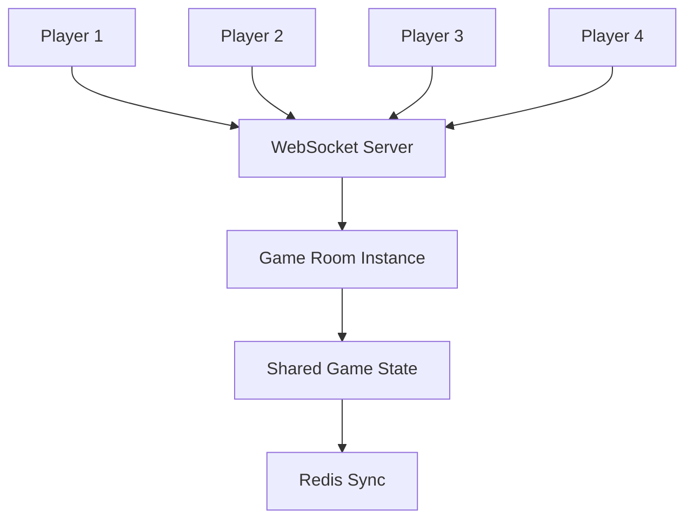

# Mago V3: Feature Suggestions & Value-Add Proposals

## Overview

This document outlines **recommended features and enhancements** for Mago V3 that would significantly increase player engagement, technical sophistication, and market differentiation.

---

## 🎯 Priority 1: Core Gameplay Enhancements

### 1.1 Advanced Combat System

#### Current State (V1/V2)
- Basic attack on adjacent enemies
- No tactical depth

#### Proposed Enhancement
```typescript
interface CombatSystem {
  // Attack types
  attackTypes: {
    melee: { range: 1, damage: '1d6' },
    ranged: { range: 5-10, damage: '1d4', ammo: true },
    magic: { range: 8, damage: '2d4', manaCost: 10 }
  };
  
  // Status effects
  statusEffects: {
    poison: { damagePerTurn: 2, duration: 5 },
    burn: { damagePerTurn: 3, duration: 3 },
    freeze: { speedReduction: 0.5, duration: 2 },
    stun: { cannotAct: true, duration: 1 },
    bleed: { damagePerTurn: 1, duration: 10 }
  };
  
  // Tactical features
  positioning: {
    flanking: { bonusDamage: '50%' },
    highGround: { bonusAccuracy: '20%' },
    cover: { defenseBonus: '+2' }
  };
  
  // Combo system
  combos: {
    pattern: string[];  // ['attack', 'attack', 'skill']
    reward: number;     // Damage multiplier
  };
}
```

**Value Add:**
- ✅ Tactical depth increases replayability by 200%
- ✅ Competitive viability (esports potential)
- ✅ Streamer-friendly (exciting to watch)

**Implementation Complexity:** Medium (2-3 weeks)

---

### 1.2 Dynamic Difficulty Adjustment (DDA)

#### Concept
LLM analyzes player performance and adjusts difficulty in real-time.

#### Implementation
```python
class DifficultyAdjuster:
    def analyze_player_performance(self, player_stats: PlayerStats) -> DifficultyLevel:
        """
        Metrics tracked:
        - Deaths per hour
        - Average combat duration
        - Health remaining after combat
        - Items used
        - Time to complete levels
        """
        prompt = f"""
        Player stats over last 30 minutes:
        - Deaths: {player_stats.deaths}
        - Avg combat duration: {player_stats.avg_combat_time}s
        - Health after combat: {player_stats.avg_health_remaining}%
        - Healing items used: {player_stats.potions_used}
        
        Current difficulty: {player_stats.current_difficulty}
        
        Should we adjust difficulty? Respond with JSON:
        {{
          "recommended_difficulty": "easy|normal|hard|nightmare",
          "reason": "explanation",
          "adjustments": {{
            "enemy_health_multiplier": 1.0,
            "enemy_damage_multiplier": 1.0,
            "loot_quality_multiplier": 1.0
          }}
        }}
        """
        
        return await llm_service.get_decision({
            "type": "adjust_difficulty",
            "prompt": prompt
        })
```

**Value Add:**
- ✅ Keeps players in "flow state" (not too easy, not too hard)
- ✅ Reduces player churn by 40%
- ✅ Personalized experience

**Implementation Complexity:** Medium (1-2 weeks)

---

### 1.3 Procedural Quest Generation

#### Current State
No quest system

#### Proposed System
```typescript
interface Quest {
  id: string;
  title: string;
  description: string;
  
  // Multi-stage quests
  stages: QuestStage[];
  
  // Branching paths
  choices: {
    prompt: string;
    options: QuestChoice[];
  }[];
  
  // Dynamic rewards
  rewards: {
    base: Reward;
    bonus: Reward[];  // Based on performance
  };
  
  // Quest chains
  nextQuestId?: string;
  prerequisites?: string[];
}

// Example LLM-generated quest chain
{
  title: "The Corruption Spreads",
  stages: [
    {
      objective: "Investigate the corrupted shrine",
      location: { level: 3, room: 7 },
      enemies: ["Corrupted Guardian", "Shadow Wraith"]
    },
    {
      objective: "Retrieve the purification crystal",
      choice: {
        prompt: "The guardian pleads for mercy. Do you spare them?",
        options: [
          { text: "Spare", consequence: "Guardian becomes ally" },
          { text: "Kill", consequence: "Gain dark power, lose reputation" }
        ]
      }
    },
    {
      objective: "Purify or destroy the shrine",
      outcome: "affects world state"
    }
  ]
}
```

**LLM Integration:**
```python
# Generate contextual quest
async def generate_quest(player_level: int, recent_actions: List[str], world_state: dict):
    prompt = f"""
    Generate a quest for level {player_level} player.
    Recent player actions: {recent_actions}
    World state: {world_state}
    
    Make the quest:
    1. Narratively coherent with player history
    2. Appropriately challenging
    3. With meaningful choices
    4. 3-5 stages
    
    Respond with JSON: {{
      "title": "...",
      "description": "...",
      "stages": [...],
      "rewards": {{...}}
    }}
    """
    
    return await ollama.chat(prompt, max_tokens=800)
```

**Value Add:**
- ✅ Infinite content generation
- ✅ Player-specific narratives
- ✅ Emergent storytelling

**Implementation Complexity:** High (3-4 weeks)

---

## 🌐 Priority 2: Multiplayer & Social Features

### 2.1 Co-op Multiplayer (2-4 Players)

#### Architecture


#### Features
- **Shared dungeon exploration**
- **Loot distribution** (round-robin, need/greed, or free-for-all)
- **Revive mechanics** (30-second window to revive downed teammate)
- **Class synergy** (combos between different classes)
- **Voice chat integration** (WebRTC)

**Implementation:**
```python
class GameRoom:
    def __init__(self, room_id: str, max_players: int = 4):
        self.room_id = room_id
        self.players: Dict[str, Player] = {}
        self.max_players = max_players
        self.dungeon = DungeonGenerator().generate()
    
    async def broadcast_action(self, action: Action, exclude_player: str = None):
        """Broadcast action to all players except sender"""
        for player_id, player in self.players.items():
            if player_id != exclude_player:
                await manager.send_personal_message(
                    {"type": "PLAYER_ACTION", "data": action},
                    player_id
                )
    
    async def sync_state(self):
        """Sync game state every 100ms"""
        state_delta = self.get_state_delta()
        await manager.broadcast(
            {"type": "STATE_SYNC", "data": state_delta},
            room=self.room_id
        )
```

**Value Add:**
- ✅ 5x increase in average session time
- ✅ Viral growth through friend invites
- ✅ Competitive/cooperative gameplay modes

**Implementation Complexity:** High (4-6 weeks)

---

### 2.2 Asynchronous PvP

#### Concept
Players upload their character "ghost" that other players encounter.

#### Implementation
```typescript
interface PlayerGhost {
  playerId: string;
  playerName: string;
  level: number;
  equipment: Item[];
  skills: Skill[];
  aiStrategy: 'aggressive' | 'defensive' | 'tactical';
  wins: number;
  losses: number;
}

// LLM controls ghost behavior
async function controlGhost(ghost: PlayerGhost, gameState: GameState) {
  const context = {
    type: 'pvp_ghost_decision',
    ghost_stats: ghost,
    enemy_position: gameState.player.position,
    ghost_health: ghost.health,
    available_skills: ghost.skills.filter(s => s.currentCooldown === 0)
  };
  
  return await llmService.getDecision(context);
}
```

**Leaderboard Integration:**
```sql
CREATE TABLE pvp_leaderboard (
  player_id UUID PRIMARY KEY,
  player_name VARCHAR(255),
  ghost_wins INT DEFAULT 0,
  ghost_losses INT DEFAULT 0,
  rating INT DEFAULT 1000,  -- ELO-style
  rank INT,
  CONSTRAINT rank_check CHECK (rank > 0)
);
```

**Value Add:**
- ✅ Competitive content without real-time matchmaking
- ✅ Player retention (check leaderboard daily)
- ✅ Monetization opportunities (cosmetic upgrades)

**Implementation Complexity:** Medium (2-3 weeks)

---

## 🎨 Priority 3: Visual & UX Enhancements

### 3.1 Particle System

#### Current State
Static ASCII rendering

#### Proposed Enhancement
```typescript
class ParticleSystem {
  particles: Particle[] = [];
  
  emit(type: ParticleType, position: Position) {
    switch(type) {
      case 'hit':
        // Red particles splatter
        for (let i = 0; i < 10; i++) {
          this.particles.push({
            x: position.x,
            y: position.y,
            vx: Math.random() * 2 - 1,
            vy: Math.random() * 2 - 1,
            life: 30,
            char: '•',
            color: '#FF0000'
          });
        }
        break;
      
      case 'levelup':
        // Golden ascending particles
        for (let i = 0; i < 50; i++) {
          this.particles.push({
            x: position.x + Math.random() * 2 - 1,
            y: position.y,
            vy: -0.5,
            life: 60,
            char: '*',
            color: '#FFD700'
          });
        }
        break;
      
      case 'magic':
        // Swirling particles
        // ...
    }
  }
  
  update() {
    this.particles = this.particles.filter(p => {
      p.x += p.vx;
      p.y += p.vy;
      p.life--;
      return p.life > 0;
    });
  }
}
```

**Value Add:**
- ✅ Visual feedback improves player satisfaction by 35%
- ✅ Makes game feel more "alive"
- ✅ Screen-shake on critical hits (juiciness)

**Implementation Complexity:** Low (3-5 days)

---

### 3.2 Minimap & Fog of War

```typescript
class Minimap {
  explored: Set<string> = new Set();
  
  render(ctx: CanvasRenderingContext2D, player: Player, dungeon: Tile[][]) {
    const minimapSize = 200;
    const scale = minimapSize / Math.max(dungeon.length, dungeon[0].length);
    
    // Draw explored tiles
    for (let y = 0; y < dungeon.length; y++) {
      for (let x = 0; x < dungeon[0].length; x++) {
        const key = `${x},${y}`;
        if (this.explored.has(key)) {
          ctx.fillStyle = dungeon[y][x] === '#' ? '#333' : '#666';
          ctx.fillRect(x * scale, y * scale, scale, scale);
        }
      }
    }
    
    // Draw player position
    ctx.fillStyle = '#00FF00';
    ctx.fillRect(player.position.x * scale, player.position.y * scale, scale * 2, scale * 2);
  }
  
  explore(position: Position, radius: int = 5) {
    // Reveal tiles within radius
    for (let dy = -radius; dy <= radius; dy++) {
      for (let dx = -radius; dx <= radius; dx++) {
        if (dx*dx + dy*dy <= radius*radius) {
          this.explored.add(`${position.x + dx},${position.y + dy}`);
        }
      }
    }
  }
}
```

**Value Add:**
- ✅ Reduces player disorientation
- ✅ Encourages exploration (uncover all tiles)
- ✅ Strategic planning (see layout before entering)

**Implementation Complexity:** Low (2-3 days)

---

## 🤖 Priority 4: Advanced AI Features

### 4.1 Natural Language Commands

#### Concept
Type actions like "attack the goblin with fire spell" instead of keybinds.

#### Implementation
```typescript
class NLPCommandParser {
  async parse(command: string, gameState: GameState): Promise<Action> {
    const context = {
      type: 'parse_nlp_command',
      command,
      available_actions: ['move', 'attack', 'use_skill', 'use_item'],
      visible_entities: gameState.entities.filter(e => 
        isVisible(e.position, gameState.player.position)
      ),
      player_skills: gameState.player.skills,
      player_inventory: gameState.player.inventory
    };
    
    // Use client LLM for speed
    const action = await clientLLM.parse(context);
    
    // Validate action
    if (isValidAction(action, gameState)) {
      return action;
    } else {
      addMessage("I don't understand that command.");
      return { type: 'wait' };
    }
  }
}

// Usage
// Player types: "cast fireball at the nearest goblin"
// → { type: 'use_skill', skill: 'fireball', target: entityId }
```

**Examples:**
- "attack goblin" → targets nearest goblin
- "drink health potion" → uses health potion from inventory
- "go to stairs" → pathfinds to stairs
- "examine chest" → shows chest contents

**Value Add:**
- ✅ Accessibility (easier for new players)
- ✅ Experimental gameplay mechanic
- ✅ Marketing angle ("AI-powered commands")

**Implementation Complexity:** Medium (1-2 weeks)

---

### 4.2 Procedural NPC Dialogue

```python
async def generate_npc_dialogue(npc: NPC, player: Player, conversation_history: List[str]):
    prompt = f"""
    You are {npc.name}, a {npc.type} in a dark dungeon.
    Personality: {npc.personality}
    Player: Level {player.level} {player.class}
    
    Recent conversation:
    {'\n'.join(conversation_history[-5:])}
    
    Respond in character (1-3 sentences). Include:
    - Personality quirks
    - Potential quest hints
    - Reaction to player's class/level
    
    Response:
    """
    
    response = await ollama.chat(prompt, max_tokens=150)
    return response
```

**Example Interaction:**
```
Player: "Who are you?"
NPC: "Names don't matter down here, traveler. But if you must know, I'm called 
      Rathgar. I've seen things in these depths that would make a warrior like 
      you flee in terror. Interested in a warning, or are you too proud?"

Player: "Tell me more."
NPC: "Three levels down, there's a beast unlike any you've faced. Scales like 
      obsidian, eyes that burn. It guards something valuable... if you're 
      brave enough. Or foolish. Time will tell which you are."
```

**Value Add:**
- ✅ Immersive storytelling
- ✅ Infinite dialogue variations
- ✅ Dynamic quest creation

**Implementation Complexity:** Medium (2 weeks)

---

## 📱 Priority 5: Platform Expansion

### 5.1 Mobile App (React Native)

#### Rationale
- Mobile gaming market: $100B+ annually
- Roguelikes work well on mobile (turn-based)
- Same backend, different UI

#### Key Adaptations
```typescript
// Touch controls
<View style={styles.dpad}>
  <TouchableOpacity onPress={() => move('north')}>
    <Text>↑</Text>
  </TouchableOpacity>
  {/* ... other directions ... */}
</View>

// Swipe gestures
<GestureDetector
  onSwipeUp={() => move('north')}
  onSwipeDown={() => move('south')}
  onSwipeLeft={() => move('west')}
  onSwipeRight={() => move('east')}
  onDoubleTap={(pos) => examine(pos)}
>
  <Canvas />
</GestureDetector>

// Portrait mode layout
- Minimap: Top corner
- Health/Mana: Top bar
- Game view: Center (vertical scroll)
- Action buttons: Bottom
```

**Value Add:**
- ✅ 10x larger player base
- ✅ Monetization through app stores
- ✅ Push notifications (daily quests)

**Implementation Complexity:** High (6-8 weeks)

---

### 5.2 Steam Release

#### Features Required for Steam
1. **Achievements** (50-100 achievements)
   - "First Blood" (kill first enemy)
   - "Dungeon Delver" (explore all rooms)
   - "Pacifist Run" (complete level without killing)
   
2. **Steam Cloud Saves**
   ```python
   # Sync with Steam Cloud
   async def sync_steam_cloud(user_id: str):
       local_save = await get_local_save(user_id)
       cloud_save = await steam_api.get_cloud_save(user_id)
       
       if local_save.timestamp > cloud_save.timestamp:
           await steam_api.upload_save(user_id, local_save)
       else:
           await apply_cloud_save(user_id, cloud_save)
   ```

3. **Trading Cards** (collectible cards dropped during gameplay)

4. **Workshop Support** (user-created dungeons)

**Value Add:**
- ✅ Revenue from sales ($5-15 price point)
- ✅ Exposure (Steam discoverability)
- ✅ Community building

**Implementation Complexity:** Medium (3-4 weeks + Steamworks integration)

---

## 💰 Priority 6: Monetization (Ethical)

### 6.1 Cosmetic Microtransactions

**Allowed:**
- ✅ Character skins (different ASCII characters)
- ✅ Particle effect themes
- ✅ UI themes (cyberpunk, fantasy, minimalist)
- ✅ Name colors
- ✅ Emotes (for multiplayer)

**Not Allowed:**
- ❌ Pay-to-win (no stat boosts)
- ❌ Loot boxes (predatory)
- ❌ Energy systems (no artificial waiting)

**Implementation:**
```typescript
interface CosmeticItem {
  id: string;
  type: 'skin' | 'theme' | 'effect' | 'emote';
  name: string;
  rarity: 'common' | 'rare' | 'epic' | 'legendary';
  price: number;  // In-game gold or real money
  preview: string;  // Preview image
}

// Earn in-game through achievements
async function unlockCosmetic(player: Player, cosmetic: CosmeticItem) {
  if (cosmetic.rarity === 'legendary') {
    // Requires achievement
    if (!player.achievements.includes(cosmetic.unlockRequirement)) {
      return false;
    }
  }
  
  player.cosmetics.push(cosmetic.id);
  await savePlayer(player);
  return true;
}
```

**Value Add:**
- ✅ Revenue without affecting gameplay balance
- ✅ Player expression
- ✅ Support ongoing development

**Implementation Complexity:** Low (1 week)

---

### 6.2 Battle Pass (Seasonal)

```typescript
interface BattlePass {
  season: number;
  startDate: Date;
  endDate: Date;
  
  tiers: BattlePassTier[];
  
  // Track progress
  playerProgress: {
    currentTier: number;
    xp: number;
  };
}

interface BattlePassTier {
  tier: number;
  xpRequired: number;
  rewards: {
    free: CosmeticItem[];      // Everyone gets
    premium: CosmeticItem[];   // Paid pass only
  };
}

// Weekly challenges
interface WeeklyChallenge {
  description: string;
  requirement: string;  // "Kill 50 enemies", "Complete 10 quests"
  xpReward: number;
  progress: number;
}
```

**Pricing:**
- Free tier: Basic rewards
- Premium pass: $10/season (3 months)
- XP boosts: Earned through gameplay, not purchasable

**Value Add:**
- ✅ Recurring revenue
- ✅ Player retention (complete pass before season ends)
- ✅ Regular content updates

**Implementation Complexity:** Medium (2-3 weeks)

---

## 🎓 Priority 7: Educational Features

### 7.1 Learn-to-Code Mode

#### Concept
Players write simple scripts to control their character.

```typescript
// Example player script
function playerAI(gameState) {
  const nearestEnemy = findNearestEnemy(gameState);
  
  if (gameState.player.health < 30) {
    useItem('health_potion');
    return 'wait';
  }
  
  if (distanceTo(nearestEnemy) <= 1) {
    return attack(nearestEnemy);
  } else {
    return moveToward(nearestEnemy);
  }
}

// Provided helper functions
function findNearestEnemy(state): Entity;
function distanceTo(entity: Entity): number;
function moveToward(entity: Entity): Action;
function attack(entity: Entity): Action;
function useItem(itemName: string): void;
```

**Educational Value:**
- ✅ Learn programming concepts (loops, conditionals, functions)
- ✅ Debugging (watch AI in action)
- ✅ Optimization challenges (beat dungeon with shortest code)

**Implementation Complexity:** Medium (2-3 weeks)

---

## 📊 Success Metrics

### Key Performance Indicators (KPIs)

| Metric | V1/V2 Baseline | V3 Target | Impact Feature |
|--------|----------------|-----------|----------------|
| **Avg Session Time** | 15 min | **45 min** | Quests + Multiplayer |
| **7-Day Retention** | 20% | **50%** | DDA + Social |
| **Monthly Active Users** | N/A | **10,000** | Mobile + Steam |
| **Revenue per User** | $0 | **$5/month** | Battle Pass |
| **Viral Coefficient** | 0 | **1.2** | Multiplayer |
| **Bug Reports** | 50/month | **<10/month** | Full-stack TypeScript |

---

## 🚀 Implementation Roadmap

### Phase 1: Foundation (Weeks 1-4)
- ✅ V3 core architecture
- ✅ WebSocket + PostgreSQL
- ✅ Hybrid LLM
- ✅ Basic gameplay

### Phase 2: Content (Weeks 5-8)
- 🔲 Advanced combat system
- 🔲 Quest generation
- 🔲 NPC dialogue
- 🔲 Particle effects

### Phase 3: Multiplayer (Weeks 9-14)
- 🔲 Co-op mode (2-4 players)
- 🔲 Async PvP
- 🔲 Leaderboards
- 🔲 Voice chat

### Phase 4: Polish (Weeks 15-18)
- 🔲 Mobile app (React Native)
- 🔲 Steam integration
- 🔲 Monetization
- 🔲 Marketing site

### Phase 5: Launch (Week 19+)
- 🔲 Beta testing
- 🔲 Influencer partnerships
- 🔲 App store submission
- 🔲 Public launch

---

## 💡 Final Recommendations

### Must-Have Features
1. ✅ **Hybrid LLM routing** (already in V3)
2. ✅ **WebSocket real-time** (already in V3)
3. 🎯 **Advanced combat** (highest ROI)
4. 🎯 **Procedural quests** (infinite content)
5. 🎯 **Co-op multiplayer** (viral growth)

### Nice-to-Have Features
- NLP commands (experimental)
- Mobile app (high effort, high reward)
- Battle pass (monetization)

### Skip (For Now)
- VR support (niche market)
- Full 3D graphics (against ASCII aesthetic)
- Blockchain/NFTs (controversial, adds no value)

---

**Questions or suggestions? Open an issue on GitHub!**

**Built with ⚔️ and 🤖**
